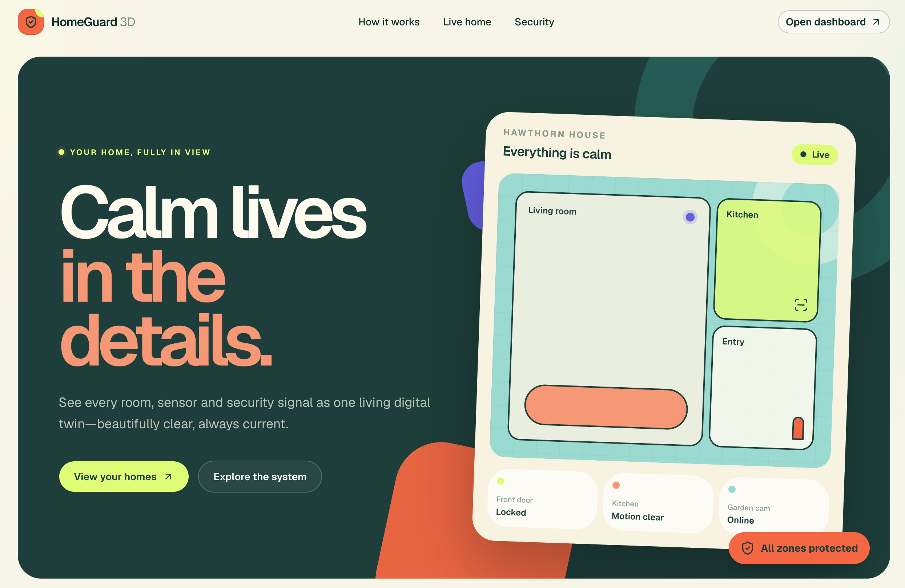

# HomeGuard 3D

See a home as it is right now: every room, door, sensor, and security signal in one place. HomeGuard 3D is a smart-home digital twin you can walk in a floor plan or in 3D, with live device state, security modes, alerts, and a full history of what happened.

It runs without physical hardware. A built-in simulation plays ordinary household stories and security incidents through the same path a real device would use, and every simulated event is labeled as simulated.

HomeGuard 3D is a demo. It is not a certified alarm or a professional monitoring service.

[](https://github.com/andrewbaisden/homeguard3d/actions/workflows/ci.yml)




## What it does

Open a property and you are looking at its current state. Switch between the 2D floor plan and the 3D twin, select a room or a device, and follow activity as it happens. Arm or disarm the home, review alerts, and replay an earlier moment from the event history.

The demo home is a two-floor house (Maple Street) with doors, windows, locks, motion sensors, and camera status placeholders. You can also create your own property and lay out floors, rooms, and devices.

## Features

- **Floor plan and 3D twin** of the same home, including a dollhouse view and a 2D fallback when WebGL is unavailable
- **Live devices** — doors, locks, motion, cameras, and connectivity, updated as events arrive
- **Security** — modes, zones, entry delay, and alarm state, with arm checks when a hot-zone opening is already open
- **Simulation** — arriving home, leaving, night mode, intrusion, and device failure, with pause, resume, reset, and speed controls
- **Alerts and automations** you can review and build as rules
- **Occupancy** shown only as unknown, vacant, or occupied, with a confidence score — never as an identified person
- **Replay** of stored history through the same state logic the live views use

## Getting started

You need Node.js 20 or newer, pnpm 9 or newer, and Docker (for local Postgres and Redis).

```bash
git clone https://github.com/andrewbaisden/homeguard3d.git
cd homeguard3d
pnpm install
docker compose up -d
cp .env.example packages/database/.env
cp .env.example apps/web/.env.local
cp .env.example apps/realtime-service/.env
pnpm db:migrate
pnpm db:seed:demo
pnpm dev
```

The app is at [http://localhost:3000](http://localhost:3000).

Sign in with **demo@homeguard.local** / **demopassword123**. To rebuild the demo home, run `DEMO_RESET=1 pnpm db:seed:demo`.

`pnpm dev` starts the web app. Live updates, simulation, and alerts also need the realtime service — see [Development](./DEVELOPMENT.md#realtime-service).

| Command | What it does |
| --- | --- |
| `pnpm dev` | Start the web app |
| `pnpm test` | Run unit tests |
| `pnpm lint` | Check formatting and lint |
| `pnpm typecheck` | Typecheck the workspace |
| `pnpm build` | Build the web app and the realtime service |

## Documentation

| Guide | What it covers |
| --- | --- |
| [Development](./DEVELOPMENT.md) | Implementation status, stack, layout, scripts, environment variables, deployment |
| [Architecture](./ARCHITECTURE.md) | System design and how structural, live, and historical state stay in sync |
| [Decisions](./DECISIONS.md) | Why the major technical choices were made |
| [Testing](./TESTING.md) | How domain logic, UI, and end-to-end journeys are tested |
| [Realtime service](./apps/realtime-service/README.md) | The process that ingests events and streams live state |
| [Agent rules](./AGENTS.md) | Constraints for engineers and coding agents changing this repo |
| [AI engineering](./AI_ENGINEERING.md) | How the project was planned and built |

## Responsible use

HomeGuard 3D is a digital-twin demo. It does not:

- replace a monitored alarm system or guarantee that a property is secure
- call police, fire, or any other emergency service
- identify people by face, voice, or any other biometric
- record or transmit real camera video or microphone audio — cameras here are status indicators with a placeholder, not a live feed
- decide that someone is committing a crime, or take an emergency action on its own

Simulated activity is stored and shown as simulation. It is never presented as something a physical device reported.

## License

Copyright © Andrew Baisden. All rights reserved.

This repository does not include an open-source license. You may read the code and run it locally to evaluate the project. Copying, modifying, or redistributing it requires permission from the copyright holder.
